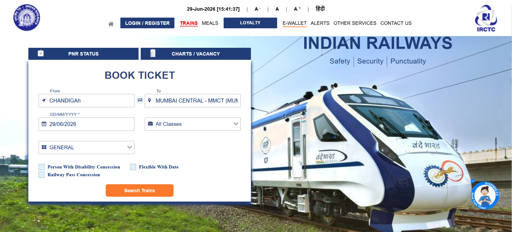

# IRCTC Problem Discovery — Part A

## Summary
- Total problems documented: 6 (3 given + 3 self-discovered)
- Platform explored: irctc.co.in (live, as of [29-06-2024])
- Devices used: [Desktop Chrome]

---

## Problem 1: Tatkal Booking Crashes at 10:00 AM [Given]

**What is broken:**
The IRCTC server becomes unresponsive or returns errors at exactly 10:00 AM when Tatkal quota opens. Users who reach the payment page often have sessions dropped, seats re-released, and OTPs delayed, causing booking failure at the final step.

**Affected users:**
Every user attempting Tatkal booking in the 9:58–10:05 AM window — an estimated 20–40 lakh active users daily, disproportionately Tier 2/3 city travelers with no flexible alternative.

**Frequency:**
Daily, every morning at 10:00 AM. Long-standing, recurring, unresolved despite multiple patches.

**Current flow — step by step:**
1. User opens IRCTC at 9:50 AM, logs in, searches for the train
2. User selects Tatkal quota — availability shows "Available 12" at 9:55 AM
3. User fills passenger details and clicks "Book Now" at 9:59:45 AM
4. At 10:00:00 AM, the page freezes — loading spinner with no progress feedback
5. After 15–45 seconds: HTTP 502 error, session timeout, or CAPTCHA reset occurs
6. User refreshes — finds they are logged out, logs back in
7. Train now shows "Tatkal WL 1" — quota is gone
8. User has no way to confirm if payment was attempted — checks bank statement in panic

**Where exactly it breaks:**
Steps 4–6: The system gives zero feedback during the freeze. Users can't tell if the request is queued, failed, or succeeded, leading to repeat clicks that increase server load and worsen the crash.

---

## Problem 2: Search Filters Do Not Work Reliably [Given]

**What is broken:**
Train search filters (quota type, class, availability, departure time) frequently fail to apply correctly, reset on page refresh, or show results that contradict the selected filter.

**Affected users:**
All users searching for trains (8 crore registered users), with senior citizens and first-time users most affected since they trust filter output without double-checking.

**Frequency:**
Filters work correctly roughly 60–70% of the time; failure rate increases during high-traffic periods. The "quota" filter is the least reliable.

**Current flow — step by step:**
1. User enters source, destination, date — clicks Search Trains
2. Results show 20–40 trains, unfiltered and overwhelming
3. User selects "Sleeper Class" and "Available" from filters
4. Page reloads — some "WL" (waitlisted) trains still appear despite the filter
5. User clicks a train — class shows "WL 34" though filter said "Available"
6. User clicks back — filter has reset to "All Classes"
7. User must reapply filters from scratch
8. User gives up filtering, manually scans all trains — adds 8–15 minutes

**Where exactly it breaks:**
Steps 3–6: Filters apply to a cached, possibly stale result set. When the page reloads with "live" data, filter state isn't preserved, causing mismatched results.

---

## Problem 3: Seat Selection Resets Randomly [Given]

**What is broken:**
During booking, a user's selected seat in the seat map is sometimes lost when proceeding to the next step, resulting in "Auto" assignment or a different berth on the passenger details page.

**Affected users:**
Users booking for families with elderly/children needing lower berths, and users with disabilities requiring specific berths — an estimated 30–40% of all booking attempts involve a seat preference.

**Frequency:**
Occurs in 15–25% of sessions involving seat map interaction; higher on mobile (~35%) than desktop (~12%).

**Current flow — step by step:**
1. User selects train, class, and quota — proceeds to seat selection
2. Seat map loads showing available, booked, and selected berths
3. User clicks a lower berth for an elderly passenger — it turns blue (selected)
4. User clicks "Proceed" — passenger details form loads
5. Seat preference shows "Auto" or a different berth — not what was selected
6. User goes back to reselect — seat map reloads, the seat now shows as taken
7. User proceeds with auto-assignment instead

**Where exactly it breaks:**
Steps 3–5: Seat selection state isn't passed correctly between the seat map component and the passenger form. On mobile, a re-render also clears local state.

---

## Problem 4: Logged-Out Users Get No Feedback When Searching for Trains [Self-Discovered]

**How I found it:**
While logged out, I went to the homepage search form, entered "Chandigarh" and "Mumbai Central" as source/destination, selected a date and class, then clicked "Search Trains." The station names were accepted and displayed correctly in the input fields, but clicking Search Trains produced no result, no page navigation, no error message, and no loading indicator.

**What is broken:**
The train search action does not respond at all when triggered by a logged-out user. The form fields work fine (autocomplete, date picker, class dropdown all function), but submitting the search silently does nothing — no redirect to results, no login prompt, no error.

**Affected users:**
Any first-time or logged-out visitor trying to check train options before creating an account — a very common pattern, since users typically want to see if trains/seats exist before bothering to register.

**Frequency:**
Observed consistently (100% of attempts) when not logged in — every search submission produced the same silent non-response.

**Current flow — step by step:**
1. User opens irctc.co.in without logging in
2. User enters "Chandigarh" in the From field — autocomplete works correctly
3. User enters "Mumbai Central" in the To field — autocomplete works correctly
4. User selects date (29/06/2026) and class (All Classes) — both register correctly
5. User clicks "Search Trains"
6. Nothing happens — no page change, no spinner, no error message
7. User clicks "Search Trains" again, assuming it didn't register
8. Same silent non-response repeats

**Where exactly it breaks:**
Step 5–6: The search submission handler does not execute (or fails silently) for unauthenticated sessions, with no fallback message such as "Please login to search trains." The user has no way to know whether the issue is their input, their connection, or the platform itself.

**Screenshot:**

---

## Problem 5: Changing Class on Results Page Does Not Refresh Availability Data [Self-Discovered]

**How I found it:**
After logging in, I searched Chandigarh → Mumbai Central and viewed the results page. I clicked the class dropdown (showing "All Classes") and switched between classes — including AC 3 Tier, Anubhuti Class, and others. Each time, the fare, availability dates, and waitlist/RAC numbers shown for "GOA SMPRK KRANT (12450)" stayed exactly the same (₹1895, WL14/WL11/WL4, RAC21/RAC12, "Updated 8 Minutes and 41 Seconds ago"), regardless of which class was selected in the dropdown.

**What is broken:**
Selecting a different class from the class dropdown on the search results page does not trigger a refresh of the displayed availability data. The fare, waitlist status, and "last updated" timestamp remain frozen on whatever was loaded initially, even after multiple class changes (AC 3 Tier → Anubhuti Class → others).

**Affected users:**
Any logged-in user comparing classes to find one with better availability — a near-universal action since the default search result rarely shows the user's preferred class with confirmed seats on the first load.

**Frequency:**
Observed consistently across 3+ class changes in a single session — the same stale data (₹1895, "Updated 8 Minutes and 41 Seconds ago") persisted through every switch, indicating a reliable, reproducible failure rather than an occasional glitch.

**Current flow — step by step:**
1. User logs in and searches Chandigarh → Mumbai Central for 29 Jun 2026
2. Results page loads showing "AC 3 Tier (3A)" tab active, fare ₹1895, dates with WL14/WL11/WL4/RAC21/RAC12
3. User opens the class dropdown (currently "Vistadome Non AC") and selects "Anubhuti Class (EA)"
4. Page updates the dropdown label to "Anubhuti Class (E..." but the fare, waitlist numbers, and "Updated X ago" timestamp stay identical to step 2
5. User selects a different class again
6. Same fare (₹1895) and same waitlist data (WL14/WL11/WL4/RAC21/RAC12) persist
7. User has no way to tell if the class change registered on the backend at all

**Where exactly it breaks:**
Step 4: Selecting a new class updates the dropdown's visual label only — it does not trigger a re-fetch of availability/fare data for that class. The displayed numbers are leftover from the previous state, misleading the user into comparing identical-looking data across classes that are actually different products.

**Screenshot:**

---

## Problem 6: Page Freezes on "Modify Search" After Logging Out Mid-Session [Self-Discovered]

**How I found it:**
While viewing the search results page as a logged-in user, I logged out and then navigated back to the same results page. The page was still showing the same train results, but clicking anywhere — including "Modify Search" — caused the screen to show a "Please Wait..." overlay that never resolved.

**What is broken:**
After logging out mid-session and returning to a previously loaded results page, the page becomes unresponsive. Any interaction (clicking Modify Search, or other controls) triggers a "Please Wait..." loading overlay that does not complete or return any result, effectively freezing the page.

**Affected users:**
Any user who logs out while a results page is open in another tab or via back navigation, then tries to continue interacting with that page — a likely scenario for users managing sessions across multiple tabs or stepping away mid-search.

**Frequency:**
Observed consistently — every interaction attempt after logout-then-return produced the same stuck "Please Wait..." state with no timeout or error shown.

**Current flow — step by step:**
1. User is logged in, viewing search results for Chandigarh → Mumbai Central
2. User logs out (in the same tab or session)
3. User navigates back to the results page (e.g. via browser back button)
4. Page still displays the old results, with the top bar reverted to "LOGIN / REGISTER"
5. User clicks "Modify Search" intending to start a new search
6. A "Please Wait..." overlay appears over the results
7. The overlay does not disappear or resolve — page is stuck
8. User clicks elsewhere, refreshes expectations, but the page remains frozen until a manual page reload

**Where exactly it breaks:**
Step 5–6: The "Modify Search" action depends on a session/auth token that is no longer valid post-logout. Instead of detecting this and redirecting to login or showing an error, the request hangs indefinitely behind a generic loading overlay, with no timeout or fallback messaging.

**Screenshot:**

---